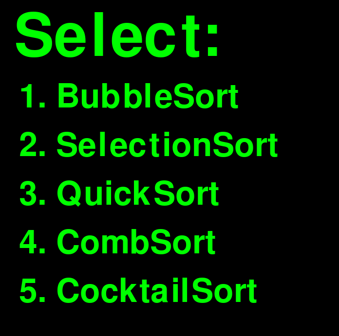

# Visualizing-Sorting-Algorithms

Willkommen zum Algorithmus Visualisierer! Dies ist eine Python-Anwendung, die verschiedene Sortieralgorithmen mithilfe der Pygame-Bibliothek veranschaulicht.

## Inhaltsverzeichnis

- [Einleitung](#einleitung)
- [Funktionen](#funktionen)
- [Installation](#installation)
- [Verwendung](#verwendung)
- [Unterstützte Algorithmen](#unterstützte-algorithmen)
- [Mitwirken](#mitwirken)
- [Lizenz](#lizenz)

## Einleitung

Diese Anwendung bietet eine visuelle Darstellung davon, wie verschiedene Sortieralgorithmen auf einer Liste von Zahlen arbeiten. Ziel ist es, Benutzern zu helfen, den Sortiervorgang besser zu verstehen, indem jeder Schritt des Algorithmus animiert wird.

## Funktionen

- Visuelle Darstellung von Sortieralgorithmen
- Unterstützt verschiedene Sortieralgorithmen
- Anpassbare Geschwindigkeit und Größe des Eingabe-Arrays
- Anzeige der Big-O-Notation für jeden Algorithmus

## Installation

1. Klonen Sie das Repository:

        git clone https://github.com/dopmore/Visualizing-Sorting-Algorithms

2. Navigieren Sie zum Projektverzeichnis:

        cd Visualizing-Sorting-Algorithms

3. Installieren Sie die erforderlichen Abhängigkeiten:

        pip install pygame

## Verwendung

Führen Sie die Haupt-Python-Datei aus, um den Visualisierer zu starten:

    python visualizer.py

Folgen Sie den Bildschirmanweisungen, um einen Sortieralgorithmus auszuwählen und diesen zu beobachten.
Nach dem dieser fertig wird, erscheint das Auswahl-Menü erneut.

## Unterstützte Algorithmen

Folgende Sortieralgorithmen werden derzeit unterstützt:

- Bubble Sort (Blasensortierung)
- Selection Sort (Selektionssortierung)
- Quick Sort (Quicksort)
- Bucket Sort (Eimersortierung)
- Comb Sort (Kamm-Sortierung)

## Mitwirken

Beiträge sind willkommen! Wenn du zu diesem Projekt beitragen möchtest, forke das Repository und erstelle einen Pull-Request mit deinen Änderungen.
Bitte beachte das dies mein erstes größeres Python Projekt ist.

## Lizenz

Dieses Projekt ist unter der MIT-Lizenz lizenziert - siehe die [LICENSE](LICENSE)-Datei für Details.
